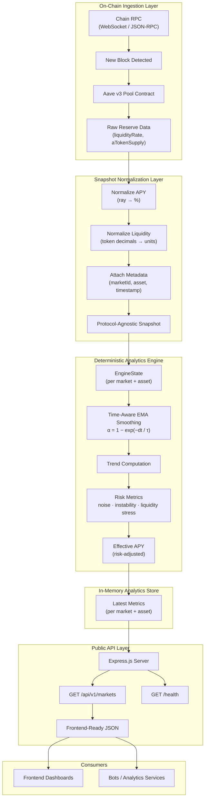

# ABY Yield Analytics Engine

**Real-Time Web3 Yield Analytics Backend**

ABY Engine is a production-grade backend system that provides real-time, deterministic yield analytics for DeFi lending markets. It continuously indexes on-chain data from multiple EVM chains, processes it through a mathematically explainable analytics engine, and exposes the results via a low-latency public API.

**What problem does it solve?**

DeFi yield data is noisy, fragmented across chains, and difficult to interpret. Most analytics tools rely on black-box ML models or delayed batch processing. ABY Engine solves this by providing:

- **Real-time indexing** — Live block-by-block data ingestion from multiple chains
- **Deterministic analytics** — Same input always produces the same output; no randomness or ML
- **Explainable metrics** — Every calculation is traceable and auditable
- **Frontend-ready API** — Clean JSON responses designed for immediate consumption

---

## High-Level Architecture

The system is structured as four distinct layers:

### 1. On-Chain Ingestion Layer

- Subscribes to new blocks on each supported chain via WebSocket/JSON-RPC
- Fetches reserve data directly from Aave v3 Pool contracts
- Extracts supply-side APY (liquidity rate) and total liquidity (aToken supply)
- One block listener per chain; chain failures are isolated

### 2. Snapshot Normalization Layer

- Transforms raw contract data into protocol-agnostic snapshots
- Normalizes APY from ray format (1e27) to percentage
- Converts liquidity from token decimals to human-readable units
- Attaches block timestamp and market identifiers

### 3. Deterministic Analytics Engine

- Maintains one stateful engine instance per (market, asset) pair
- Applies time-weighted EMA smoothing to yield levels
- Computes trend direction and multi-dimensional risk metrics
- Produces effective APY adjusted for volatility and liquidity stress

### 4. Public API Layer

- Express.js server exposing RESTful endpoints
- Reads only from in-memory state; no database queries
- Stateless request handling for horizontal scalability
- JSON responses optimized for frontend consumption


## Key Features

| Feature | Description |
|---------|-------------|
| Real-Time Multi-Chain Indexing | Block-by-block data ingestion from Ethereum, Polygon, Optimism, and Arbitrum |
| Deterministic Yield Analytics | Pure mathematical transformations; no ML, no randomness |
| Protocol-Agnostic Engine | Core engine accepts normalized snapshots from any lending protocol |
| In-Memory Low-Latency API | Sub-millisecond response times; no database overhead |
| Production Deployment Ready | Designed for cloud hosting with long-lived background indexing |
| Frontend-Ready Response Format | Clean, consistent JSON structure for immediate UI integration |
| Isolated Chain Failures | One chain going offline does not affect other chains |
| Configurable Throttling | Rate-limit protection for RPC providers |

---

## Supported Protocols, Chains, and Assets

### Protocol

- **Aave v3** — Supply-side lending analytics

### Chains

| Chain | Market ID |
|-------|-----------|
| Ethereum | `aave-v3-ethereum` |
| Polygon | `aave-v3-polygon` |
| Optimism | `aave-v3-optimism` |
| Arbitrum | `aave-v3-arbitrum` |

### Assets

| Asset | Ethereum | Polygon | Optimism | Arbitrum |
|-------|----------|---------|----------|----------|
| USDC | Yes | Yes | Yes | Yes |
| USDT | Yes | Yes | Yes | Yes |
| USDE | Yes | — | — | — |
| crvUSD | Yes | — | — | — |

**Extensibility:** The architecture supports easy addition of new protocols, chains, and assets. Each component (chain config, indexer, asset list) is modular and can be extended without modifying core engine logic.

---

## API Overview

### Base URL

The API is deployed as a long-running service. When hosted on Render or similar platforms:

```
https://your-deployment-url.onrender.com
```

### Endpoints

| Method | Endpoint | Description |
|--------|----------|-------------|
| GET | `/api/v1/markets` | Returns latest analytics for all indexed markets and assets |
| GET | `/health` | Health check endpoint |

### Request Example

```bash
curl https://your-deployment-url.onrender.com/api/v1/markets
```

---

## API Response Example

The `/api/v1/markets` endpoint returns a nested object organized by market ID and asset symbol:

```json
{
  "aave-v3-ethereum": {
    "USDC": {
      "marketId": "aave-v3-ethereum",
      "asset": "USDC",
      "timestamp": 1706745600,
      "metrics": {
        "smoothedAPY": 4.52,
        "effectiveAPY": 4.18,
        "trend": 0.012,
        "risk": {
          "noiseVariance": 0.0021,
          "instabilityVariance": 0.0034,
          "liquidityStress": 0.047
        }
      }
    },
    "USDT": {
      "marketId": "aave-v3-ethereum",
      "asset": "USDT",
      "timestamp": 1706745600,
      "metrics": {
        "smoothedAPY": 3.89,
        "effectiveAPY": 3.61,
        "trend": -0.005,
        "risk": {
          "noiseVariance": 0.0018,
          "instabilityVariance": 0.0029,
          "liquidityStress": 0.032
        }
      }
    }
  },
  "aave-v3-polygon": {
    "USDC": {
      "marketId": "aave-v3-polygon",
      "asset": "USDC",
      "timestamp": 1706745602,
      "metrics": {
        "smoothedAPY": 2.91,
        "effectiveAPY": 2.74,
        "trend": 0.003,
        "risk": {
          "noiseVariance": 0.0015,
          "instabilityVariance": 0.0022,
          "liquidityStress": 0.028
        }
      }
    }
  }
}
```

### Metrics Reference

| Metric | Type | Description |
|--------|------|-------------|
| `smoothedAPY` | number | EMA-smoothed supply APY (percentage) |
| `effectiveAPY` | number | Risk-adjusted APY accounting for volatility and liquidity |
| `trend` | number | Directional momentum of APY (positive = rising, negative = falling) |
| `noiseVariance` | number | Short-term APY fluctuation intensity |
| `instabilityVariance` | number | Structural unpredictability of yield |
| `liquidityStress` | number | Capital fragility indicator (higher = more stress) |

---

## Engine Design Philosophy

The analytics engine follows strict design principles to ensure reliability and auditability:

### Deterministic

- No randomness in any calculation
- Same input snapshot sequence always produces identical output
- Enables reproducible backtesting and auditing

### Explainable Math

- Every metric derives from documented mathematical formulas
- No hidden weights or learned parameters
- Full traceability from raw input to final output

### Time-Aware EMA Smoothing

- Uses continuous-time exponential decay: `alpha = 1 - exp(-dt / tau)`
- Handles irregular time gaps gracefully
- Separate time constants for different metric sensitivities

### Separation of Concerns

- **EngineState** — Pure data container, no logic
- **Update Modules** — Stateless mathematical transformations
- **Engine** — Orchestration and time control only

### No Cross-Domain Mutation

- Each update module reads state and writes only to its designated fields
- No side effects or hidden dependencies between modules
- Enables independent testing and verification

---

## Local Development

### Requirements

- **Node.js** v18 or higher
- **npm** v8 or higher
- RPC access to at least one supported chain (Alchemy, Infura, or similar)

### Installation

```bash
git clone https://github.com/your-username/aby-engine.git
cd aby-engine/backend
npm install
```

### Environment Variables

Create a `.env` file in the `backend/` directory:

```bash
# Server port (optional, default: 3000)
PORT=3000

# RPC URLs (at least one required)
ETHEREUM_RPC_URL=https://eth-mainnet.g.alchemy.com/v2/your-key
POLYGON_RPC_URL=https://polygon-mainnet.g.alchemy.com/v2/your-key
OPTIMISM_RPC_URL=https://opt-mainnet.g.alchemy.com/v2/your-key
ARBITRUM_RPC_URL=https://arb-mainnet.g.alchemy.com/v2/your-key

# Optional: Custom Pool addresses (defaults to official Aave v3 addresses)
# ETHEREUM_POOL_ADDRESS=0x...
# POLYGON_POOL_ADDRESS=0x...

# Optional: Throttling configuration
# BLOCK_THROTTLE_MS=5000        # Min ms between processing blocks per chain
# STARTUP_RPC_DELAY_MS=2000     # Delay between chain RPC checks at startup
```

### Running Locally

```bash
cd backend
npm start
```

The server will:
1. Validate RPC connectivity for each configured chain
2. Skip chains with missing or unreachable RPCs
3. Start block listeners for all verified chains
4. Begin serving API requests on the configured port

```
Server listening on http://localhost:3000
GET /api/v1/markets — latest analytics
GET /health — health check
```

---

## Deployment Notes

### Long-Lived Background Service

The backend is designed to run continuously as a background service:

- Block listeners run indefinitely, processing new blocks as they arrive
- Analytics state accumulates over time, improving smoothing accuracy
- The service continues indexing even with zero API traffic

### Stateless API, Stateful Indexer

| Component | State Model | Scalability |
|-----------|-------------|-------------|
| API Routes | Stateless | Horizontally scalable (with shared state) |
| Block Indexer | Stateful (in-memory) | Single instance per deployment |
| Analytics Engine | Stateful (per market) | Memory-bound |

### Cloud Hosting Compatibility

The service is designed for deployment on cloud platforms:

- **Render** — Use "Background Worker" or "Web Service" with no sleep
- **Railway** — Standard Node.js deployment
- **Fly.io** — Single-region deployment recommended
- **AWS/GCP** — Container or VM deployment

### Production Considerations

- Use dedicated RPC endpoints to avoid rate limiting
- Configure `BLOCK_THROTTLE_MS` to match your RPC tier limits
- Monitor memory usage as engine state grows with market count
- Consider process managers (PM2) for automatic restarts

---

## Roadmap / Future Work

### Protocol Expansion

- [ ] Curve Finance — LP yield analytics
- [ ] Pendle Finance — Fixed yield and PT/YT analytics
- [ ] Morpho — Optimized lending rate analytics

### Real-Time Features

- [ ] WebSocket streaming for live updates
- [ ] Server-sent events (SSE) alternative

### Data Persistence

- [ ] Historical time-series storage
- [ ] Backfill capability for new markets
- [ ] Query API for historical analytics

### Analytics Enhancements

- [ ] Risk model tuning and calibration
- [ ] Cross-market correlation metrics
- [ ] Yield prediction confidence intervals
- [ ] Alert threshold configuration

---

## License

MIT License

---

## Disclaimer

This software is provided for **educational and analytical purposes only**.

- The analytics produced by this system do not constitute financial advice
- Past yield performance does not guarantee future results
- Users should conduct their own research before making investment decisions
- The authors are not responsible for any financial losses incurred

---

## Author

**Krish**

Deterministic DeFi Analytics Engineering
